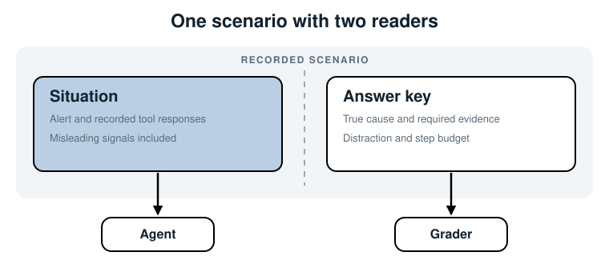
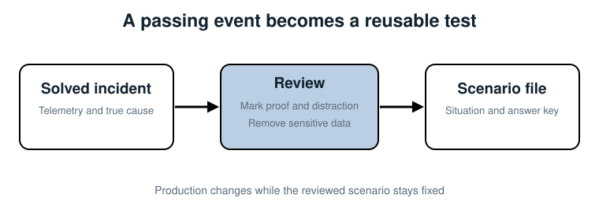

## 4. Record a Test Case Your Agent Will Face

*Turn one solved incident into a test you can run again, with the situation on one
side and the known answer on the other.*

The checkout incident is over. The service is healthy, the logs will soon roll away,
and the database pool is back to normal. If we leave the facts in production, we lose
the case.

This chapter saves it as a *scenario*: one recorded situation plus an answer key. By
the end, you can load the file, inspect both sides, and reject an incomplete record.
We won't run the agent yet. First we need a case worth replaying.

### What we are building

A scenario has two jobs that must not be mixed:

- The **situation** recreates what the agent could have seen during the incident.
- The **answer key** records what we learned after the incident was solved.



Read the figure from the center. Both sides belong to one case, but they have
different readers. The alert and recorded tool responses will go to the agent. The
true cause and grading rules will go to the grader in Chapter 7. Chapter 6 will turn
the dotted boundary into a code boundary.

This split matters because incident truth often arrives late. During an outage, an
engineer sees alerts, logs, metrics, and recent changes. After the fix, the team knows
which signal was proof and which one only looked suspicious. A useful test case keeps
both views.

### Step 1: choose a solved case

Start with an incident that has a confirmed cause. "We think it was the database"
isn't enough. You need evidence strong enough that another engineer would reach the
same answer.

For our case, the timeline is clear:

| Time | Event | Meaning |
|---|---|---|
| 14:02 | A deploy changes `DB_MAX_CONNECTIONS` from 50 to 5 | Candidate cause |
| 14:03 | Checkout latency crosses two seconds | Customer impact begins |
| 14:03 | All five connections are busy and 40 requests wait | The pool is exhausted |
| 14:06 | Payment-provider latency rises from 90 ms to 180 ms | Real, but too late to cause the incident |

The deploy and pool status prove the cause together. The payment-provider line is a
good distraction because it is believable but contradicted by the order of events.

> **Warning:** Don't create answer keys from unresolved incidents. A disputed answer
> turns the benchmark into a test of one author's opinion.

### Step 2: record the situation

Create the Chapter 4 folder and open
`scenarios/checkout-latency.json`. The first half is the situation:

```json
{
  "id": "checkout-latency-after-pool-change",
  "situation": {
    "alert": {
      "service": "checkout-service",
      "message": "checkout-service p95 latency > 2s",
      "started_at": "14:03"
    },
    "tool_responses": {
      "get_metrics": { "service": "checkout-service", "...": "..." },
      "get_logs": { "service": "checkout-service", "...": "..." },
      "get_deploys": { "service": "checkout-service", "...": "..." },
      "get_db_status": { "service": "checkout-service", "...": "..." }
    }
  }
}
```

The abbreviated values above keep the page readable; the file in the chapter folder
contains every response. Record the values the real tools returned, not a summary of
them. Chapter 5 will serve these values through replay tools, so their shape needs to
match what the agent already expects.

Record enough context to make the case understandable on its own:

- Give the scenario a stable `id`. Reports and benchmarks will use it later.
- Keep the original alert, including its service and start time.
- Save one response per tool that the agent may call.
- Keep misleading signals. Removing them makes the test easier than the real job.
- Remove secrets and personal data before the file enters source control.

### Step 3: write the answer key

The second half records the truth and the rules for this one case:

```json
"answer_key": {
  "true_category": "deploy",
  "true_cause": "The 14:02 deploy reduced DB_MAX_CONNECTIONS from 50 to 5, exhausting the connection pool.",
  "required_evidence": ["get_deploys", "get_db_status"],
  "distraction": "payment-provider latency increased at 14:06",
  "max_steps": 4
}
```

Each field answers a grading question:

| Field | Question it answers |
|---|---|
| `true_category` | Did the agent classify the cause correctly? |
| `true_cause` | What actually happened? |
| `required_evidence` | Which tool results prove it? |
| `distraction` | Which believable wrong lead should it reject? |
| `max_steps` | How much investigation is reasonable for this case? |

The answer key should describe one acceptable result, not prescribe every sentence
the agent must write. We compare the structured category exactly in Chapter 7. We
leave judgment about the prose to Chapter 8.

The step budget also belongs to the case, not to the agent. A simple incident may
need three or four actions; a broad dependency failure may need more. One global
budget would make easy cases too loose and hard cases impossible.

### Step 4: see how recording works

Recording is a small editing process, not an automated dump of production.



The middle review is where most of the value is added. Raw telemetry tells you what
happened at the time. The incident review tells you what mattered. Sanitizing removes
data that should not enter a test repository. Only then do you save the situation and
answer key together.

A recorder could automate collection later. Keep the review step even then. A tool
can collect logs; it cannot decide by itself that the payment-provider line is the
right distraction or that four steps is a fair budget.

### Step 5: load and validate the file

The loader turns loose JSON into named records:

```python
@dataclass(frozen=True)
class Situation:
    alert: Dict[str, str]
    tool_responses: Dict[str, Any]


@dataclass(frozen=True)
class AnswerKey:
    true_category: str
    true_cause: str
    required_evidence: List[str]
    distraction: str
    max_steps: int


@dataclass(frozen=True)
class Scenario:
    id: str
    situation: Situation
    answer_key: AnswerKey
```

`frozen=True` stops code from changing a loaded record by accident. The loader also
checks required fields and rejects a step budget below one. This is intentionally
small validation. It catches broken records without hiding the format behind a large
framework.

Run the check from the chapter folder:

```bash
cd devops-ai-guidelines/07-evaluating-ai-agents/code/chapter-04
python check_scenario.py
```

```text
Scenario:          checkout-latency-after-pool-change
Alert:             checkout-service p95 latency > 2s
Recorded tools:    get_metrics, get_logs, get_deploys, get_db_status
True category:     deploy
Required evidence: get_deploys, get_db_status
Step budget:       4
```

That output is an inventory, not a score. It proves that the case has the inputs and
known answer that later chapters need.

### A failure worth catching early

Suppose someone records the alert and logs but forgets `required_evidence`. The agent
can still run, and a category-only grader can still pass it. Weeks later, nobody can
tell whether the agent diagnosed the pool change or guessed "deploy."

The loader rejects that scenario when it enters the suite:

```text
ValueError: answer_key is missing: required_evidence
```

Failing at load time is better than publishing a score based on an incomplete case.

### Where else this applies

The schema stays the same when the job changes. Only the values differ.

| Agent | Situation | Answer key |
|---|---|---|
| Support | Ticket, account state, policy lookups | Correct resolution, required policy, misleading detail |
| SQL | Question, schema, recorded query results | Expected result, required tables, query budget |
| Code fixing | Issue, repository state, test output | Correct behavior, required test, unrelated failure |
| Research | Question and recorded sources | Supported answer, required sources, false lead |

### Summary

- A scenario is one reusable test case with a situation and an answer key.
- Record raw tool responses in the same shape the live tools return.
- Keep realistic distractions; don't clean the case until it becomes trivial.
- Write the answer key only after the cause is confirmed and reviewed.
- Validate every scenario before it enters the benchmark.

Next: turn the recorded responses into tools the unchanged agent can call.