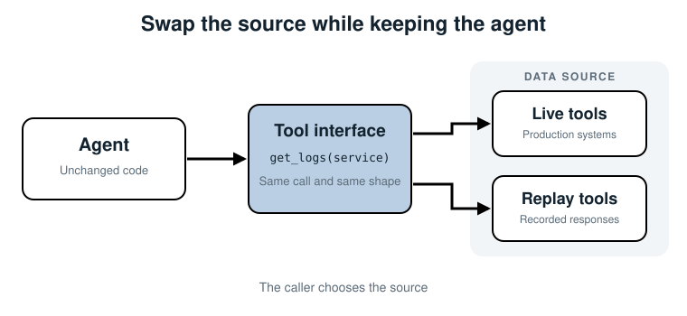
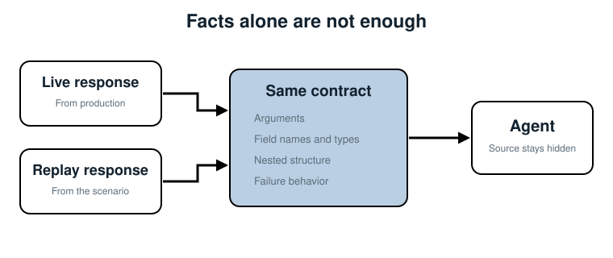

## 5. Replay That Case to Your Agent

*Replace changing production tools with recorded ones, while leaving the agent and
its tool interface alone.*

Chapter 4 gave us a frozen case. It still sits in a JSON file, and the agent does not
know how to investigate JSON. The agent knows how to call `get_metrics`, `get_logs`,
`get_deploys`, and `get_db_status`.

This chapter builds the adapter between those two worlds. We replace the live tool
functions with *replay tools*: functions with the same names, inputs, and outputs,
backed by recorded data. The agent code does not change.

### What replay changes

Only the source behind each tool changes.



Follow either path from the agent. In production, `get_logs("checkout-service")`
queries a log system. In evaluation, the same call reads the saved `get_logs`
response. Both return the dictionary the agent already understands.

That is the main design rule for replay:

> Change where tool data comes from, not how the agent asks for it.

If replay requires evaluation-only branches inside the agent, you are no longer
testing the production behavior. You are testing a special version that may act
differently.

### Step 1: keep the agent unchanged

The Chapter 5 folder copies `agent.py` from Chapter 1 without changing its loop. The
agent still receives its tools as a dictionary:

```python
class Agent:
    def __init__(self, tools, call_model, max_steps=6):
        self.tools = tools
        self.call_model = call_model
        self.max_steps = max_steps
```

When it chooses a tool, it calls that function normally:

```python
name = action["tool"]
observations[name] = self.tools[name](alert["service"])
```

There is no `if replay_mode` here. The caller decides which tool dictionary to
inject. This is the same dependency-injection pattern we used for `call_model` in
Chapter 1.

### Step 2: build replay tools

`build_replay_tools` creates one function per saved response:

```python
from copy import deepcopy


def build_replay_tools(situation):
    tools = {}

    for tool_name, recorded_response in situation.tool_responses.items():
        def replay(service, response=recorded_response):
            if service != response.get("service"):
                raise ValueError(
                    f"recorded response is for {response.get('service')}, not {service}"
                )
            return deepcopy(response)

        tools[tool_name] = replay

    return tools
```

There are three small details here that prevent confusing failures.

**Bind `recorded_response` in the default argument.** Python closures look up loop
variables when the function runs. Without `response=recorded_response`, every replay
function would return the final response in the loop. `get_metrics` might return the
database status, even though the dictionary keys look correct.

**Check the service.** This recording belongs to `checkout-service`. If the agent
asks for another service, returning checkout data would create a plausible but false
run. Failing clearly is safer.

**Return a deep copy.** Agent code may sort a list or add a note to a response. If we
returned the stored dictionary itself, one run could change what the next run sees.
A fresh copy keeps replay repeatable.

### Step 3: preserve the response shape

The live and replay tools do not need the same implementation. They do need the same
contract.



The contract includes more than the field names:

- The function accepts the same arguments.
- Required fields are present and use the same types.
- Lists and nested objects keep the same structure.
- Errors that the agent handles are represented consistently.

For example, both versions of `get_db_status("checkout-service")` return:

```python
{
    "service": "checkout-service",
    "pool_size": 5,
    "in_use": 5,
    "waiting": 40,
    "note": "pool exhausted: 5 of 5 connections in use, 40 requests queued",
}
```

Suppose the recording used `queued_requests` instead of `waiting`. The facts would be
present, but the agent might not read them. A low score would then measure a broken
recording, not a weak agent.

> **Tip:** Capture tool responses at the boundary where the agent receives them. This
> is usually easier than rebuilding raw database or API state behind each tool.

### Step 4: wire the recorded run

Load the scenario, build the replay tools from its situation, then inject them:

```python
scenario = load_scenario(Path("scenarios/checkout-latency.json"))
tools = build_replay_tools(scenario.situation)
agent = Agent(tools=tools, call_model=scripted_model)
conclusion = agent.run(scenario.situation.alert)
```

The scripted model follows a clear path: metrics, deploys, database status, then a
conclusion. It stands in for a real model so this example stays deterministic and
needs no API key. The replay method works the same with an LLM.

Run it:

```bash
cd devops-ai-guidelines/07-evaluating-ai-agents/code/chapter-05
python run_replay.py
```

```text
Scenario:   checkout-latency-after-pool-change
Root cause: 14:02 deploy cut DB_MAX_CONNECTIONS 50->5, exhausting the pool
Category:   deploy
Evidence:   get_deploys, get_db_status
Steps:      4
```

We have not graded this conclusion. The important result is that the unchanged agent
investigated a recorded case through its normal tool calls.

### Step 5: check repeatability

Run the command again. The alert, tool responses, and scripted decisions are fixed,
so the output should match exactly.

A real LLM may still vary even when the tools do not. Replay controls the environment;
it does not make a sampled model deterministic. Chapter 9 handles that by running
cases more than once and reporting consistency. For now, freezing the tool data
removes the largest source of noise.

### When replay silently lies

A team once records only successful tool calls because failures look like test noise.
The evaluation agent learns that every query works on the first try. In production,
the log backend times out, and the agent has no useful recovery path.

Recorded failures are part of the situation too. If a case depends on a timeout, an
empty result, or a permission error, store that outcome and make the replay tool raise
or return it in the same way as the live tool. A clean recording of a messy incident
is not a faithful recording.

### Where else this applies

Replay sits at the tool boundary for any agent:

| Agent | Live source | Replay source |
|---|---|---|
| Support | CRM and knowledge-base APIs | Saved account and article responses |
| SQL | Data warehouse | Recorded schema and query results |
| Code fixing | Repository and test runner | Fixed repository snapshot and test output |
| Research | Search and page fetches | Saved result pages and documents |

The agent should not know which column it is using.

### Summary

- Replay tools keep the production tool interface and replace only the data source.
- Inject tools from outside the agent; don't add an evaluation mode to its logic.
- Match arguments, fields, types, nested structure, and errors.
- Return copies of recorded data so one run cannot change another.
- Replay freezes the environment, which makes runs comparable even if the model can
  still vary.

Next: stop passing the complete scenario through the run and make it impossible for
the agent to see the answer key.