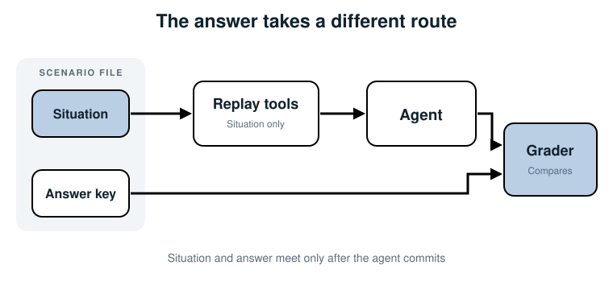
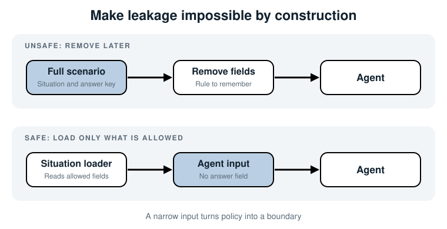

## 6. Keep the Answer Away from the Agent

*Load only the situation into the agent run, and reserve the answer key for grading
after the run ends.*

We now have a complete scenario and replay tools. The easiest way to wire them is also
the dangerous way: load the whole scenario, pass it through several helpers, and trust
each helper to use only the fields it needs.

That trust will fail eventually. A prompt builder may serialize the whole object. A
debug message may include it. A model adapter may accept a broad `context` dictionary
and send every key. The agent then sees the answer, and the benchmark still prints a
high score.

This chapter makes the answer-key boundary part of the code.

### What the agent may see

The routing rule is simple:



The agent receives the alert and observations returned by replay tools. The grader
later receives the agent's conclusion and the answer key. No arrow carries the answer
key into the run.

This is *answer-key isolation*. It is not security against hostile code running in
the same process. It prevents ordinary engineering mistakes by making the safe path
the natural path.

Validity metadata takes a separate route too. The runner checks it against a
current-system manifest before constructing agent input. Neither the manifest nor
the answer key is sent to the model.

### Why a hidden instruction is still an answer

Leakage is not limited to a field named `answer_key`. Any fact that tells the agent
how it will be graded can spoil the test:

- The true category in a system prompt.
- Required evidence names in evaluation metadata.
- The distraction labeled as "irrelevant."
- A filename such as `deploy-caused-pool-exhaustion.json`.
- A tool response note added after the review that says "root cause."

The incident data itself can contain the cause. It should: the agent needs evidence
from which to reason. The leak happens when we add the reviewed conclusion or grading
rules to what the agent sees.

### Step 1: define separate types

Chapter 4 used one `Scenario` object because we were inspecting the record. The
runtime now uses two types:

```python
@dataclass(frozen=True)
class AgentInput:
    scenario_id: str
    alert: Dict[str, str]
    tool_responses: Dict[str, Any]


@dataclass(frozen=True)
class AnswerKey:
    scenario_id: str
    true_category: str
    true_cause: str
    required_evidence: List[str]
    distraction: str
    max_steps: int
```

`AgentInput` cannot carry the truth by accident because it has no place for it. The
shared `scenario_id` lets the grader match the conclusion and answer key later without
passing the answer through the agent.

The sample file also has `validity`, which the preflight reads before this split.
It never becomes a field of `AgentInput`. If the case is expired, no agent run starts.

Keep the names literal. `AgentInput` tells a reviewer what may cross the boundary.
Names such as `ScenarioContext` or `RunData` invite more fields over time because
their limits are unclear.

### Step 2: use two loaders

The scenario stays in one JSON file so authors can review the case as a unit. Code
opens it through two narrow loaders.

The runtime loader reads only the situation:

```python
def load_agent_input(path):
    raw = json.loads(path.read_text(encoding="utf-8"))
    situation = raw["situation"]
    return AgentInput(
        scenario_id=raw["id"],
        alert=situation["alert"],
        tool_responses=situation["tool_responses"],
    )
```

The grader-side loader reads only the answer key:

```python
def load_answer_key(path):
    raw = json.loads(path.read_text(encoding="utf-8"))
    return AnswerKey(scenario_id=raw["id"], **raw["answer_key"])
```

This may look like repeated file reading. It is deliberate. The agent process does
not construct a full scenario and then remove the answer. It never creates the
`AnswerKey` object. Parsing one JSON file still reads its bytes into memory, so this
is an API boundary against accidental prompt leakage, not a security boundary for
untrusted code with file access. Both loaders check their required fields.

In a larger system, these loaders can run in separate processes or jobs. The same API
still works: one service sends `AgentInput` to the runner; another loads `AnswerKey`
for grading.

### Step 3: narrow replay to `AgentInput`

Chapter 5's replay builder accepted a `Situation`. It now accepts `AgentInput`:

```python
def build_replay_tools(agent_input: AgentInput):
    for tool_name, recorded_response in agent_input.tool_responses.items():
        # Build the same replay callables as Chapter 5.
        ...
```

That type signature is a useful review guard. A future developer can see that replay
has no need for grading data. Static checks can also catch a caller that passes the
wrong object.

### Step 4: keep grader imports out of runtime code

Open `run_isolated.py`. Its imports tell the story:

```python
from agent import Agent
from agent_input import load_agent_input
from replay import build_replay_tools
from validity import check_case
```

There is no import from `answer_key.py`. The runner cannot casually pass an answer
object to the prompt because it never loads one.

The stand-in model now reads logs, deploys, and database status. It derives the
category from the observed deploy change and waiting requests; it does not contain
the expected answer as a literal. This is still a small scripted example, not proof
that an arbitrary LLM prompt is free of leaks.

The example also checks the object before running:

```python
check_case(path, current_system)
agent_input = load_agent_input(path)
visible_fields = asdict(agent_input)
assert "answer_key" not in visible_fields
```

Run it:

```bash
cd devops-ai-guidelines/07-evaluating-ai-agents/code/chapter-06
python run_isolated.py
```

```text
Agent can see: scenario_id, alert, tool_responses
Agent can see answer key: no
Conclusion category: deploy
Answer key is not passed to the agent.
```

The assertion is a useful smoke test, but the real protection is the narrow type and
loader. A check can be forgotten. An object without the field is harder to misuse.
Neither this assertion nor the example tests the final messages sent to a real model.

### Safe and unsafe designs



On the unsafe path, every function receives more authority than it needs. The answer
can leak through prompt formatting, logging, tracing, or a later refactor. On the safe
path, the runtime receives only allowed data. There is nothing to remember to remove.

This is the same reason APIs return purpose-built response objects instead of entire
database rows. Narrow data is easier to reason about.

### Step 5: inspect the final prompt boundary

Types protect the Python side. You should still inspect what crosses the model API
boundary. Log a redacted copy of the final messages in a test and check that they
contain only:

- The task instructions.
- The alert.
- Observations from tools the agent called.
- The trajectory so far, if the model needs it.

Search that payload for the true cause, expected category, required-evidence list,
and grader wording. Do this whenever prompt construction changes.

> **Warning:** Don't log secrets just to test isolation. Use a local scenario with
> sanitized data, as we do here.

### The failure that looks like progress

Imagine a helper builds the prompt like this:

```python
prompt = json.dumps(asdict(scenario))
```

The model now reads `true_category: deploy` before choosing a tool. Your score jumps
from 70% to 100%. Runs get shorter too, because the model no longer needs evidence.
The dashboard looks better in every way.

This is why leakage is worse than an ordinary test failure. A broken test often turns
red. A leaked answer turns green and tells you to trust it. Keeping the answer out of
the runtime object graph prevents that false progress.

### Where else this applies

Every evaluation task has information that belongs only after the run:

| Agent | Agent may see | Grader only |
|---|---|---|
| Support | Ticket, account state, policy text | Correct resolution and rubric |
| SQL | Question, schema, returned rows | Expected result and required tables |
| Code fixing | Issue, code, test feedback | Reference behavior and hidden tests |
| Research | Question and source documents | Supported claims and source requirements |

Hidden tests in coding benchmarks use the same idea. The program may run against
them, but the agent must not read their expected assertions before writing the fix.

### Summary

- Store the situation and answer key together for authors, but load them through
  separate runtime and grader paths.
- Give the agent an `AgentInput` type with no answer-key field.
- Keep answer-key imports out of the agent runner and prompt builder.
- Check case validity before running, without passing metadata to the agent.
- Check the final model payload for leaked truth or grader instructions.
- Leakage produces convincing false progress, which makes isolation a core part of
  the evaluation rather than optional cleanup.

Next: load the answer key on the grader side and turn its rules into hard pass/fail
checks.