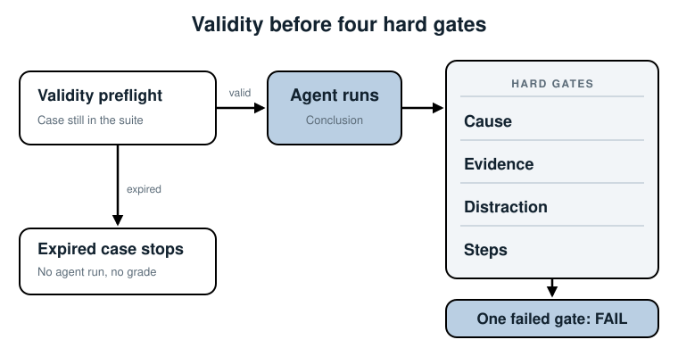
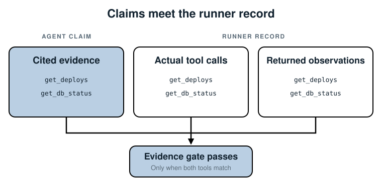

## 7. Score It with Hard Gates

*Use facts the runner recorded, not the agent's confidence, to decide whether one
investigation passed.*

Chapter 2's category-only grade let a lucky agent pass without opening a tool. We
now have a recorded case, replay tools, and a wall around its answer key. The missing
step is a grader that notices the difference between a diagnosis and a guess.

This chapter adds four *hard gates*: cause, evidence, distraction, and step budget.
They use exact values and recorded actions. Chapter 8 will use Jev for the meaning of
the agent's prose, which exact checks cannot establish.

### What the grader receives

The agent must commit before the grader loads the answer key. In the Chapter 7
folder, `run_grade.py` checks the case's validity, runs the agent, then loads the
answer key and checks that both sides have the same scenario ID.

The grader sees the conclusion and the path behind it. Chapter 1 recorded the
agent's `evidence` claims and `trajectory`; this chapter also keeps the actual
tool responses in `observations`. The runner creates that last field, not the model:

```python
if action["type"] == "call_tool":
    name = action["tool"]
    observations[name] = self.tools[name](alert["service"])
```

The grader never passes the answer key into `Agent.run`. An expired case stops at the
validity check and gets no grade at all.



Read the figure from the left. Validity is a precondition, not a fifth gate: it asks
whether the case still belongs in today's suite. Only a valid case reaches the agent
and the four pass/fail checks. A single failed gate makes the hard-gate result fail.

### Step 1: make the cause checkable

The agent's paragraph can use many words for the same incident. We don't compare it
to the answer key with string equality. Instead, the conclusion now includes two
short fields alongside `root_cause`:

```python
cause_change = "DB_MAX_CONNECTIONS 50 -> 5"
cause_effect = "pool_exhausted"
```

The answer key contains those fields and `true_category: deploy`. The cause gate
checks all three exactly, then checks the actual deploy response and pool counters.
The matching deploy must come before the alert and the pool must be full with
requests waiting. Naming only `deploy`, or guessing the right structured fields
without supporting observations, is not enough.

These fields are a small contract for this diagnosis task. Another agent needs its
own cause fields. Chapter 8 checks whether the agent's prose agrees with this
structured answer and the observed data. The gate cannot tell if a fluent paragraph
contradicts correct structured fields.

### Step 2: check the work actually done

The `evidence` list is written by the agent. On its own it proves nothing: the lucky
agent can name both required tools without calling either.

```python
calls = [step["tool"] for step in conclusion.trajectory if step["type"] == "call_tool"]
consulted = set(calls) & set(conclusion.observations)
evidence = set(answer.required_evidence) <= consulted
evidence_claims = set(answer.required_evidence) <= set(conclusion.evidence) <= consulted
```

The grader requires both recorded calls with returned observations and honest
citations. A cited tool that never ran fails. So does an investigation that opened
the right tools but cited none of them in its answer.



The left side is the agent's claim; the right side is the runner's record. The
overlap alone is not enough: both required tools must appear in the record and in
the agent's citations. We use the runner's record because the agent cannot rewrite
it after the run.

### Step 3: handle the distraction honestly

The payment-provider line is in `get_logs`, at 14:06. A run that never calls
`get_logs` has not rejected it. The grader checks that a returned log line
actually contains `payment-provider` *after* the 14:03 alert. It then checks
that the conclusion marks the signal as rejected and does not use its ID as
the structured cause.

That gives three useful recorded outcomes: *not available to the agent*,
*available and marked rejected*, or *available and blamed*. Only the middle
one passes this case's distraction gate. We cannot prove the model paid
attention to every line it was given.

There is a limit: `rejected_signals` is still an agent claim. These checks can
verify that the signal was available and the final structured answer did not blame
it. They cannot inspect the model's private reasoning. That's why we also test the
final explanation in Chapter 8 and review failures against human labels.

### Step 4: count steps in code

This case allows five actions: four tool calls and a conclusion. The grader counts
the recorded trajectory and requires its last action to be `conclude`. It doesn't
ask a model to count. A run that exhausts its budget returns `unknown` without a
conclusion action, so it fails.

### Run three agents

From `code/chapter-07/` run:

```bash
python run_grade.py
python -m unittest test_grade.py
```

The expected gate results are:

| Agent | Cause | Evidence | Distraction | Steps | Result |
|---|---|---|---|---|---|
| Careful: checks all four tools | pass | pass | pass | pass | PASS |
| Lucky: guesses the right cause | fail | fail | fail | pass | FAIL |
| Misled: reads logs, blames payment | fail | fail | fail | pass | FAIL |

The lucky agent even guesses the exact structured cause and cites tools it never
called. Without returned deploy and pool data, its cause and evidence gates fail.
The tests also remove the log observation, move the payment line before the alert,
replace the pool with a healthy one, and add a sixth action. Each change challenges
a different check.

### Keep the two results separate

`grade` returns one boolean per gate and an overall `passed` value. Do not turn the
number of passing gates into a confidence score: three out of four is still a failed
case. Chapter 8 will attach a separate Jev judgment to this result. A favorable
judge answer will not turn a failed hard gate green.

### Where else this applies

For a support agent, the cause fields might be a resolution and policy ID, while
actual evidence is the policy lookup in its trajectory. For a SQL agent, check the
expected result and the tables it queried. In every case, prefer facts your runner
can verify over a model's claims about what it did.

### Summary

- Gate the structured cause, actual and cited evidence, handled distraction, and
  recorded action count.
- An unseen distraction is not a rejected one.
- All gates must pass; category alone can still be a lucky guess.
- Hard gates cannot judge whether free-form prose is coherent or unsupported.

Next: ask Jev targeted questions about the conclusion's meaning, without letting it
rewrite these gates.